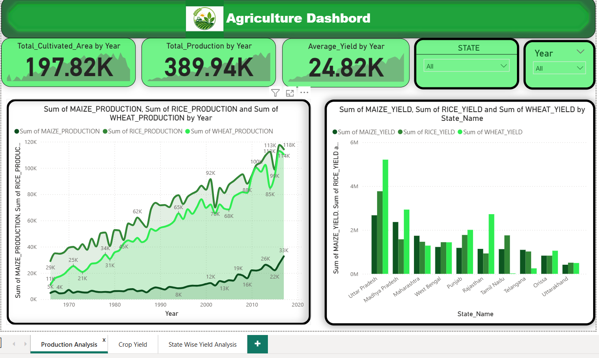
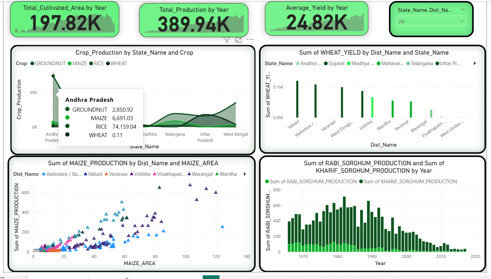
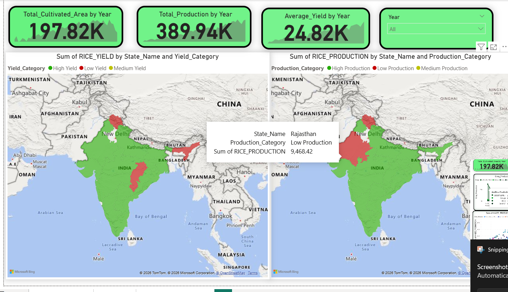

Agriculture Dashboard – README
Project Name: Agriculture Dashboard
Tool Used: Microsoft Power BI
Project Overview:
This Power BI Agriculture Dashboard provides detailed insights into agricultural production, crop performance, yield analysis, and state-wise trends using interactive visualizations and KPI cards.
Dashboard Features

•	Year-wise Production Analysis

•	Crop Yield Analysis

•	State-wise Production Insights

•	District-wise Yield Comparison

•	Interactive Filters and Slicers

•	KPI Cards for Area, Production, and Yield

•	Trend Analysis using Charts and Graphs

Skills Used

•	Power BI Dashboard Design

•	Data Visualization

•	DAX Measures

•	Data Cleaning & Transformation

•	Interactive Dashboard Development

•	Business Intelligence

Dashboard Screenshots

 
Production Analysis Dashboard Screenshot
 
Crop Yield & State Analysis Dashboard Screenshot
Conclusion
This project demonstrates how Power BI can transform raw agricultural datasets into interactive and meaningful business insights for better analysis and decision-making.

